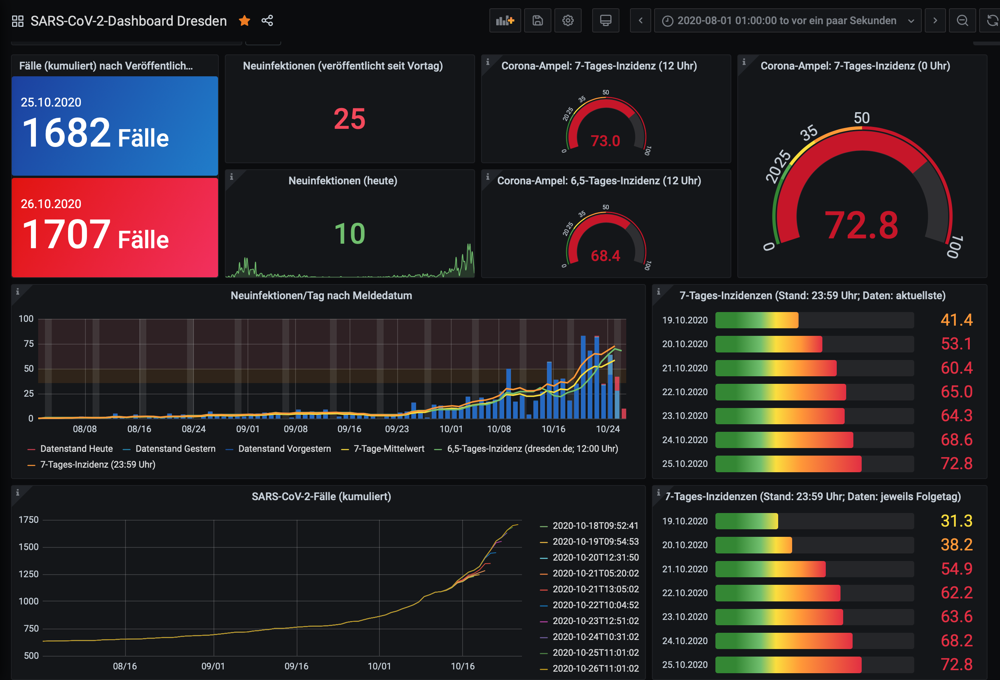

# Coronavirus Dresden

[](https://github.com/jdieg0/coronavirus-dresden/blob/main/LICENSE)
[](https://github.com/jdieg0/coronavirus-dresden/releases)

<a href="https://raw.githubusercontent.com/jdieg0/coronavirus-dresden/main/assets/images/grafana_covid-19-dashboard-dresden_screenshot.png"></a>

This script collects official infection statistics published by the city of Dresden and saves them to [InfluxDB](https://www.influxdata.com/products/influxdb-overview/). From there the data can be processed and visualised using the SQL-like query language [InfluxQL](https://docs.influxdata.com/influxdb/v1.8/query_language/spec/) and, for instance, [Grafana](https://grafana.com/docs/grafana/latest/datasources/influxdb/).

Subsequent changes to the published data set can also be detected and routinely logged.

## Data source

The raw data provided by the [city of Dresden](https://www.dresden.de/de/leben/gesundheit/hygiene/infektionsschutz/corona.php) and visualised on their [Dashboard](https://stva-dd.maps.arcgis.com/apps/opsdashboard/index.html#/3eef863531024aa4ad0c4ac94adc58e0) is obtained from the following source:

- [Overview over all tables and data fields](https://services.arcgis.com/ORpvigFPJUhb8RDF/ArcGIS/rest/services/corona_DD_7_Sicht/FeatureServer/layers)
- [Web form for queries](https://services.arcgis.com/ORpvigFPJUhb8RDF/ArcGIS/rest/services/corona_DD_7_Sicht/FeatureServer/query)
- [Download the latest JSON dump](https://services.arcgis.com/ORpvigFPJUhb8RDF/arcgis/rest/services/corona_DD_7_Sicht/FeatureServer/0/query?f=json&where=ObjectId>=0&outFields=*)

Data is available under an open licence compatible with CC-BY:

```Landeshauptstadt Dresden, ```[```dl-de/by-2-0```](https://www.govdata.de/dl-de/by-2-0)```, ```[```opendata.dresden.de```](https://opendata.dresden.de/)

## Install

Using a virtual environment of your choice is recommended. An exemplary installation with ```venv``` is described below.

### venv (recommended)

    git clone https://github.com/jdieg0/coronavirus-dresden.git
    cd coronavirus-dresden

	python3 -m venv venv
	source venv/bin/activate

    pip install -r requirements.txt

### InfluxDB (required)

#### [macOS](https://docs.influxdata.com/influxdb/v1.8/introduction/install/)

	brew install influxdb
	brew services start influxdb

#### [Ubuntu](https://docs.influxdata.com/influxdb/v1.8/introduction/install/)

    wget -qO- https://repos.influxdata.com/influxdb.key | sudo apt-key add -
    source /etc/lsb-release
    echo "deb https://repos.influxdata.com/${DISTRIB_ID,,} ${DISTRIB_CODENAME} stable" | sudo tee /etc/apt/sources.list.d/influxdb.list
    sudo apt-get update && sudo apt-get install influxdb
    sudo service influxdb start

#### Python API

Helpful resources:

- [Getting Started with Python and InfluxDB](https://www.influxdata.com/blog/getting-started-python-influxdb/)

### Grafana (optional)

#### [mac OS](https://grafana.com/docs/grafana/latest/installation/mac/)

    brew install grafana
    brew services start grafana

## Run

    python collect.py

### cron

To search for new data regularly, enter:

    sudo crontab -e

Add the following line to run the script every 5 minutes (adapt paths to suit your own installation):

    */5 * * * * /root/bin/coronavirus-dresden/venv/bin/python /root/bin/coronavirus-dresden/collect.py --log --archive-json

### Command line arguments

To display all data collection options, type:

    python collect.py --help